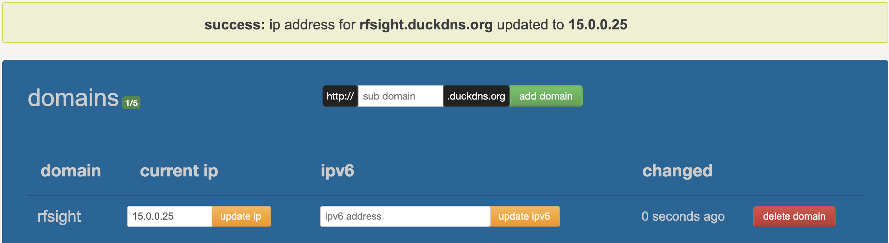
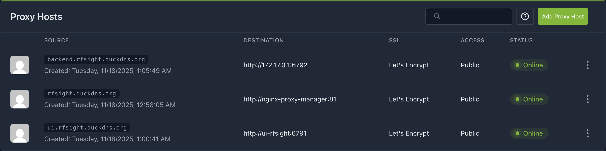

<h1 align="center">RFSight</h1>

<p align="center">
<a href="#dart-about">About</a> &#xa0; | &#xa0;
<a href="#sparkles-features">Features</a> &#xa0; | &#xa0;
<a href="#rocket-technologies">Technologies</a> &#xa0; | &#xa0;
<a href="#white_check_mark-requirements">Requirements</a> &#xa0; | &#xa0;
<a href="#checkered_flag-starting">Starting</a> &#xa0; | &#xa0;
<a href="https://github.com/petribrn" target="_blank">Author</a>
</p>

## :dart: About

RFSight is a prototype network device management system designed specifically for Regional Internet Service Providers (ISPs) operating with radio frequency (RF) technologies.

Developed as a Bachelor's degree completion project at UFSC (Universidade Federal de Santa Catarina), RFSight addresses the challenge of Vendor Lock-in by implementing a Hardware Abstraction Layer. This allows ISPs to manage heterogeneous networks composed of multi-vendor equipment (such as Intelbras, Ubiquiti, Mikrotik, and White Label devices) through a unified, agnostic interface without the need for code refactoring.

## :sparkles: Features

:heavy_check_mark: Agnostic Device Adoption: Identifies and registers devices on the network via ARP scan (L2), using configurable Profiles to abstract API differences between manufacturers;

:heavy_check_mark: Real-Time Monitoring: Continuous collection of metrics via ICMP (ping) and custom actions (HTTP/SSH), with instant interface updates via WebSockets;

:heavy_check_mark: Hybrid Topology Visualization: Automatic discovery of the network graph (Point-to-Point and Point-to-Multipoint) by cross-referencing ARP scan data with antenna SNMP association tables;

:heavy_check_mark: Active Management: Execution of remote commands (such as Reboot, Update Firmware, Change Config) through a sequential action queue builder;

:heavy_check_mark: Declarative Profiles: Configurable JSON files that teach the system how to communicate with new device models (No-Code Integration).

## :rocket: Technologies

The following tools were used in this project:

  * Frontend: React, TypeScript, Redux Toolkit, Material UI (MUI), React Flow

  * Backend: Python, FastAPI, AsyncIO, Pydantic, Scapy, Paramiko

  * Database: MongoDB

  * Infrastructure: Docker & Docker Compose

##Before starting :checkered_flag:

You need to have [Git](https://git-scm.com/), [Python](https://www.python.org/) and [Docker/Docker Compose](https://www.docker.com/get-started/) installed.

Additionally, for the system to fully function (especially remote access and secure features like WSS), the following external infrastructure setup is required:

#### 1. DuckDNS (or similar):

  * Required to provide secure connection, combined with SSL certificate managed in a proxy.
  * Create an account at [duckdns.org](https://duckdns.org) and configure a domain pointing to the local RFSight host IP address (e.g., rfsight.duckdns.org -> 15.0.0.10).

  

#### 2. Nginx Proxy Manager:

  * [Nginx Proxy Manager](https://nginxproxymanager.com/guide/) is one of the containers that support RFSight, acting as a Gateway and Reverse Proxy to manage HTTP/HTTPS traffic.
  * Handles SSL termination.
  * Must be configured to forward traffic from your domain to the Frontend container (port 6791) and Backend (port 6792, you will need to get the localhost IP address from Docker network to configure Backend proxy host, e.g 172.17.0.1).
  * SSL Certificate (Let's Encrypt):
    * Generated via Nginx Proxy Manager to enable HTTPS and attached to the DuckDNS domain.

  


## 1. Clone the project

```
$ git clone [https://github.com/petribrn/rfsight](https://github.com/petribrn/rfsight)

# Access
$ cd rfsight
```

## 2. Start the system

The project includes helper scripts for easy management:

### Give execution permissions
```
$ chmod +x install.sh init.sh stop.sh
```

### Initial Install (Builds images and starts containers)
```
$ ./install.sh
```

### Start (Up existing containers)
```
$ ./init.sh
```

### Stop (Down containers)
```
$ ./stop.sh
```


## 3. Access the System

After initialization, the services will be available at:

```
Frontend (UI): https://ui.rfsight.duckdns.org

Backend (API): https://backend.rfsight.duckdns.org

Nginx Proxy Manager: https://rfsight.duckdns.org

MongoAdmin: http://localhost:3046 (only from localhost)

SMTP4Dev (Emails): http://localhost:5400 (only from localhost)
```

## :file_folder: Project Architecture

* backend/src/controllers/: Orchestration logic.

  * AdoptionController.py: Manages ARP discovery and the initial adoption flow.

  * MonitorController.py: Runs asynchronous loops for ping and SNMP collection.

  * ConfigController.py: Processes queues of management actions.

  * backend/src/services/device_driver.py: The core of the abstraction layer. Interprets the Profile and executes real communication with the hardware.

* frontend/src/shared/store/: State management with Redux.

  * slices/topologySlice.ts: Contains logic for Throughput calculation and graph drawing.

  * middleware/websocketMiddleware.ts: Manages persistent connection and server message routing.

Made by <a href="https://github.com/petribrn" target="_blank">Bruno Petri</a>

<a href="#top">Back to top</a>
